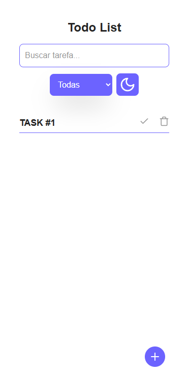

# 📋 Todo List

Uma aplicação de lista de tarefas desenvolvida com **HTML**, **CSS**, **JavaScript** e **TailwindCSS**.  
Permite ao usuário adicionar, concluir e excluir tarefas. As tarefas são salvas no **Local Storage** e o layout é **totalmente responsivo**.

---

## 🚀 Funcionalidades

- ✅ Adicionar novas tarefas  
- ✔️ Marcar tarefas como concluídas  
- 🗑️ Remover tarefas individualmente
- 🌙 Modo dark/light
- 💾 Salvamento automático das tarefas com Local Storage  
- 📱 Layout responsivo adaptado a diferentes telas  

---

## 🧰 Tecnologias utilizadas

- HTML5  
- CSS3  
- JavaScript (ES6)  
- TailwindCSS  

---

## 🔍 Detalhes técnicos

- Manipulação dinâmica do DOM com JavaScript puro  
- Armazenamento de tarefas com `localStorage`  
- Interface moderna utilizando utilitários do TailwindCSS  
- Responsividade garantida com o uso de `flex`, `grid`, `breakpoints`, etc.

---

## 📸 Capturas de tela

> Adicione aqui imagens ou gifs do seu projeto em funcionamento, por exemplo:

```md
<<<<<<< HEAD


=======


>>>>>>> f4822ac36f184e4ca18ce6ade32295ac46e4a031
